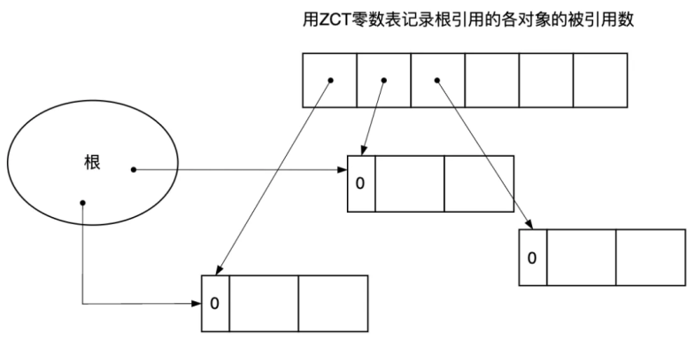
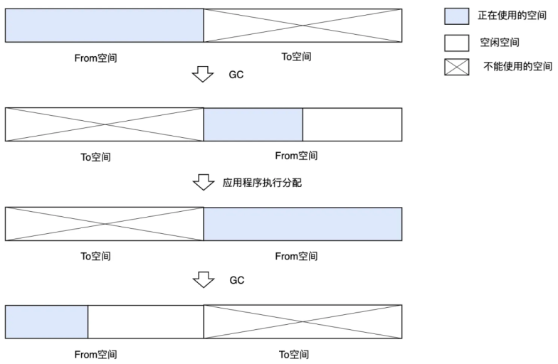
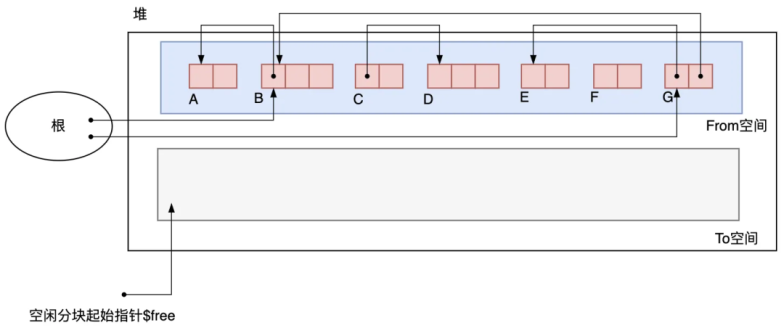
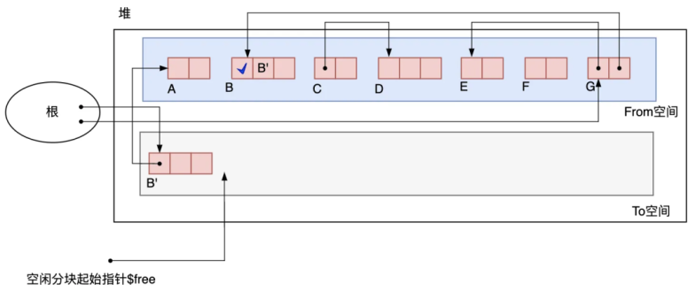
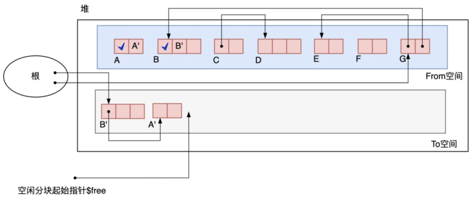
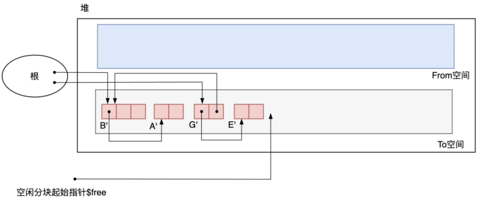
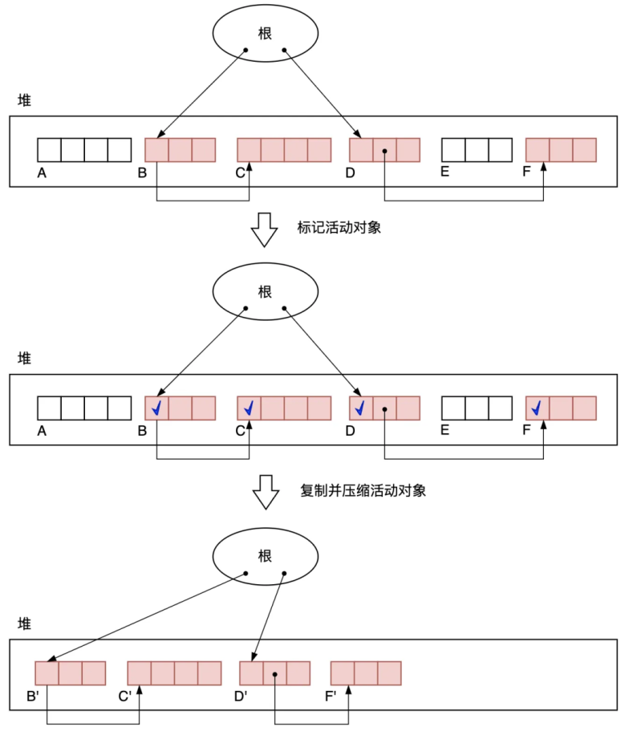

# JVM_STUDY
## [2024.10.18]
### GC算法
- 标记清除法
  - 由标记阶段和清除阶段构成。标记阶段是把所有活动对象都做上标记的阶段。/
  清除阶段是把那些没有标记的对象，也就是非活动对象回收的阶段。通过这两个阶段，就可以令不能利用的内存空间重新得到利用。
  - 标记阶段：
    - 在标记阶段中，垃圾回收器 Collector 会为堆里的所有活动对象打上标记。为此，我们首先要标记通过根直接引用的对象。
    首先我们标记这样的对象，然后递归地标记通过指针数组能访问到的对象。这样就能把所有活动对象都标记上了。 标记 Mark 对象，是在对象的头部进行置位操作。
    -标记完所有活动对象后，标记阶段就结束了。从根对象沿着指针引用找下去，会发现有四个对象被引用，都需要打上标记位。在标记阶段中，程序会标记所有活动对象。毫无疑问，标记所花费的时间是与“活动对象的总数”成正比的。 
  - 清除阶段：
    - 在清除阶段中，垃圾回收器 Collector 会遍历整个堆，回收没有打上标记的对象（即垃圾），使其能再次得到利用。
    - 在清除阶段，GC 程序会遍历堆，具体来说就是从堆首地址开始，按顺序一个个遍历对象的标志位。如果一个对象设置了标记位，就说明这个对象是活动对象，必然是不能被回收的。
    - GC 程序会把非活动对象回收再利用。回收对象就是把对象作为分块，连接到被称为“空闲链表”的单向链表。在之后进行分配时只要遍历这个空闲链表，就可以找到分块了。
    - 在清除阶段，程序会遍历所有堆，进行垃圾回收。也就是说，所花费时间与堆大小成正 比。堆越大，清除阶段所花费的时间就会越长。
  - 改进：
    - 分配速度的改进——多个空闲链表（golang的内存分配处理）\
      利用分块大小不同的空闲链表，即创建只连接大分块的空闲链表和只连接小分块的空闲链表，甚至不同规格大小的分块采用不同的空闲链表管理。这样一来，只要按照应用程序所申请的对象大小选择空闲链表，就能在短时间内找到符合条件的分块了。/
      比如分配到3字节内存空间的都放在同一个链表中按照顺序进行排列，分配到5字节内存空间的在另一个链表中，当申请3字节内存空间后直接在第一个链表中去添加，
    - 分配空间碎片化分块问题的改进——BiBOP 法（ Big Bag Of Pages）\
      - 碎片化问题：这些空闲内存以小且不连续方式出现在不同的位置。
      - 将大小相近的对象整理成固定大小的块进行管理的做法
      - 把堆分割成多个规格大小的空间，让每个规格的空间只能配置同样大小的分块。
      - 比如：2个字的分块只能在最左边的堆空间里分配，3个字的分块只能在中间的堆空间分配，4个字的块在最右边。像这样配置对象，就会提高内存的使用效率。
      - 可以用多个空闲链表的方式来实现分块，将2个字节的快空间放在一起形成一个表
- 引用计数法
  - 原理：每个对象记录多少程序应用自己，如果没有程序引用直接清除
  - A 的指针由指向 B 改为指向 C 时，各对象的计数器的变化情况。初始状态下从根引用 A 和 C，从 A 引用 B。A 持有唯一指向 B 的指针，假设现在将该指针更新到了 C，B 的计数器值变成了 0，计数器变更时，计数器为0的对象会被回收，因此 B 被回收了。且 B 连接上了空闲链表， 能够再被利用了。又因为新形成了由 A 指向 C 的指针，所以 C 的计数器的值增量为 2。
  
  - 改进：
    - 延迟引用计数法\
      采用一个零数表 ZCT(Zero Count Table)来存储从根引用的各对象的被引用数，即使这个值变为0，程序也先不回收这个对象（延迟一词体现在这），而是等零数表 ZCT 爆满或者空闲链表为空时再扫描零数表 ZCT，删除确实没有被引用的对象。这样一来即使频繁重写堆中对象的引用关系，对象的计数器值也不会有所变化，因而大大改善了“计数器值的增减处理繁重”这一缺点。
    
    - 减少计数器位数的Sticky 引用计数法\
      如果此对象被大于 31 个对象引用，那么计数器就会溢出。对于计数器溢出的对象，有两种处理方法：1）什么都不做，2）通过GC标记-清除法进行管理。
      - 对于计数器溢出的对象，什么都不做。这样一来，即使这个对象成了垃圾(即被引用数为 0)，也不能将其回收。也就是说， 白白浪费了内存空间。然而事实上有很多研究表明，很多对象一生成马上就死了。也就是说， 在很多情况下，计数器的值会在 0 到 1 的范围内变化，鲜少出现 5 位计数器溢出这样的情况。
      - 对于计数器溢出的对象，通过GC标记-清除法进行管理。具体实现就不展开了。这种方式，在计数器溢出后即使对象成了垃圾，程序还是能回收它。另外还有一个优点，那就是还能回收循环的垃圾。
- GC 复制算法
  - 基础原理：\
    -  只把某个空间里的活动对象复制到其他空间，把原空间里的所有对象都回收掉。在此，我们将复制活动对象的原空间称为 From 空间，将粘贴活动对象的新空间称为 To 空间。 
    -  利用 From 空间进行分配的。当 From 空间被完全占满时，GC 会将活动对象全部复制到 To 空间。当复制完成后，该算法会把 From 空间和 To 空间互换，GC 也就结束了。From 空间和 To 空间大小必须一致。这是为了保证能把 From 空间中的所有活动对象都收纳到 To 空间里 \
    
  - 执行过程
    
    - 此时From空间已经占满，需要将根指针连接的对象及其子对象拷贝至To空间。
    
    - 先拷贝B对象，将B对象拷贝出B'并将根节点指向B',原来对象B实体信息变为B',判断是否还有子对象，B 里保存了指向 B’的指针，因为原 From 空间还有其他对象要通过 B 找到 B’。
    
    - 拷贝子级对象步骤：
      - 判断其子对象是否有To空间的指针，如果存在直接指向to空间对应的对象，结束该子类的拷贝
      - 将B对象的子对象A拷贝出来为A'，如果判断其是否还有子对象，依次类推直至没有子对象为止
    
    - G对象同理，最后清除from空间，于是F、C、D对象就由于不使用而被清除了。
  - 优化：
    - Cheney 的 GC 复制算法
      - 采用广度搜索算法来处理对象的拷贝
    - 多空间复制算法
      - 把堆 N 等分，对其中 2 块空间执行 GC 复制算法，对剩下的（N-2）块空间执行 GC 标记-清除算法，也就是把这 2 种算法组合起来使用。
- GC 标记-压缩算法
  -  GC 标记-清除算法与 GC 复制算法相结合的产物
  - 执行过程
    - 标记阶段\
    
    搜索根引用的对象及其子对象并打上标记，这里采用深度优先搜索。然后将打上标记的活动对象复制到堆的开头。压缩阶段并不会改变对象的排列顺序，只是缩小了它们之间的空隙， 把它们聚集到了堆的一端。
    
    - 
### GC性能指标
- 吞吐量 实际操作时间（减去垃圾回收处理所用的时间）/总的时间
- 最大暂停时间：添加监听器用于监听
- 堆使用效率  使用堆数量（ManagementFactory.getMemoryMXBean().getHeapMemoryUsage()）/最大堆容量
- 访问的局限性

## [2024.10.16-10.17]
### GC需要解决的问题
  - 内存泄漏   MemoryLeakExample \
    内存得不到释放,即使不用该对象，依旧存在内存中不被释放
  - 悬垂指针   DanglingReferenceExample\
    已经被释放或不再有效的内存区域的指针，再次访问它会导致未定义的行为。
  - 错误释放
    - 双重释放（Double Free）：同一块内存被释放两次。这种情况可能导致程序崩溃或未定义的行为。
    ```c
      int* ptr = (int*)malloc(sizeof(int));
      free(ptr);
      free(ptr); // 错误：第二次释放同一指针
    ```
    - 释放未分配的内存：试图释放一个未通过 malloc 或类似方法分配的指针。这会引发运行时错误。
    ```c
     int* ptr; // ptr 没有分配内存
     free(ptr); // 错误：释放未分配的指针
    ```