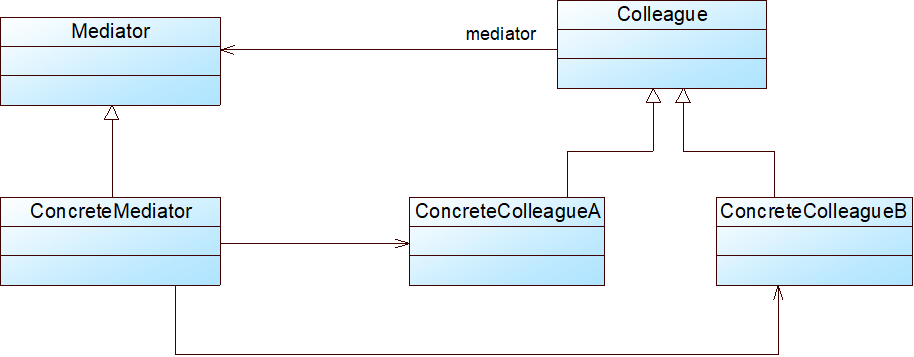

# Java设计模式——中介模式

## 1.中介者模式

不同于外观模式和代理模式，中介者类是同等类之间的交流，涉及到的类既是请求的接收者有是请求的发送者。类似于学生之间传纸条，每个人都是平等的，双向的信息传递，传递纸条的人就是充当了中介者，中介者主要的工作就是控制、打包、转发对应的消息。

中介者模式中的抽象同事类中存在两种方法，一种是对自身的改变，一种是调用中介者去改变其他相关联的具体同事类。往往后者会由抽象同事类自己去实现，去调用中介者实现交流沟通，前者由具体同事类实现，让中介类调用进行改变对应的具体同事类的属性。

## 2.中介者模式特点

**优点**：

- 简化了对象之间的交互，它用中介者和同事的一对多交互代替了原来同事之间的多对多交互，将原本难以理解的网状结构转换成相对简单的星型结构。传递纸条不必一定要与实际的目标对象进行交流，相当于借助了一个中介者进行的信息的多对多传递，只需要解决同事与中介的多对一关系，中介与同事的一对多关系即可
- 可将各同事对象解耦。各同事不必相互交流，只需要与中介者交流，便可以实现与其他人的一对一，或者多对一交流
- 可以减少子类生成，中介者模式将原本分布于多个对象间的行为集中在一起，改变这些行为只需生成新的中介者子类即可，这使得各个同事类可被重用，无须直接对同事类进行扩展。子类对象只需要在中介者生成一次对象，如果有新的同事类，只需要在原有中介者上进行继承，并加入新的同事类对象即可实现代码的复用。

**缺点**：

- 在具体中介者类中包含了大量的同事之间的交互细节，可能会导致具体中介者类非常复杂，使得系统难以维护。中介者的职责会越来越多，控制会逐渐复杂起来。

**使用环境：**

- 系统中对象之间存在复杂的引用关系，系统结构混乱且难以理解
- 一个对象由于引用了其他很多对象并且直接和这些对象通信，导致难以复用该对象
- 想通过一个中间类来封装多个类中的行为，又不想生成太多的子类
