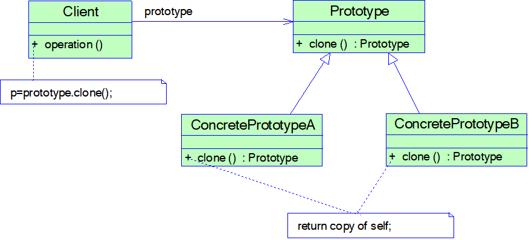
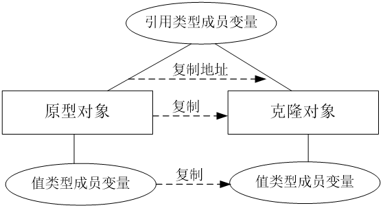
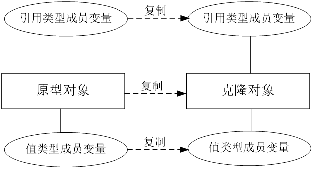

# Java设计模式——原型模式

## 1.原型：

使用原型实例指定待创建的对象类型，并且通过赋值整个原型创建新的对象。

包含两个角色：

1.Prototype抽象原型类：声明克隆方法的接口

2.ConcretePrototype(具体原型类)：具有克隆自身所有属性的方法的具体类

就好比我们需要复制一份文件（ConcretePrototype），我们交给打字机去处理，那么打字机就需要拿出另一张白纸（Prototype）将调用文件的克隆方法去将文件的内容复制到白纸中，但是打字机只能把表面的效果复制，如果其中有一个图片，新的白纸就会打印出图片的地址，让我们去找旧文件去看对应的图片，指向我们之前文件的那个图片。这样表面上我们获得了一份新的文件，但是我们要看图片还是看的旧的文件中的图片。

如果我们需要一个完全独立的文件，我们就需要深度克隆，将旧文件拆分成多个小块（序列化），然后让打字机去每一个小块的信息打印出来，然后按照旧文件的顺序重新拼装所有的小块，最终得到一个完全独立的文件，且具有相应的图片信息，因为图片拆成小块最终还是字节码。

## 2.原型模式的特点：

1）优点：

①简化对象创建过程，通过已知实例创建新的实例

②拓展性好，客户端针对抽象原型进行编程民间具体原型类写在配置文件中，减少或者添加产品对原系统无影响

③简化了创建结构，工厂方法需要一个与产品等级结构相同的工厂等级结构，原型模式是针对已有实体的复制，而工厂模式是针对抽象产品提供的模板进行复制。原型模式就是对着一个具体产品的复制，而工厂就是对着模具进行复制。

④深度克隆能创建一个独立的备份用于实验，即使失败，旧的对象依旧可以备份回来。

2）缺点：

①需要给每一个类提供一个克隆方法，相当于对已有类进行改造时需要修改源代码，违背了开闭原则。

②在实现深度克隆需要编写负责的的代码，对象之间存在多重嵌套引用。

3）使用环境：

①创建新的对象成本较大，初始化需要消耗大量内存

②系统需要保存对象的状态，而对象的状态变化很小，

③避免使用分层次的工厂类来创建分层次的对象，并且类的实例对象只有一个或者很少的组合状态，通过复制原型对象获得到新实例对象可能比用构造函数创建一个新的实例对象要更加方便