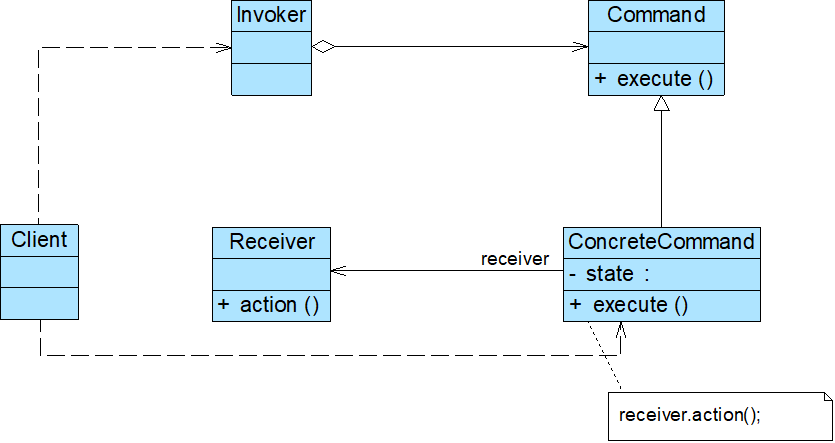

# Java设计模式——命令模式

## 1.命令模式

发送者和接收者之间没有直接的引用关系

## 2.命令模式特点

### 2.1优点

- 降低系统的耦合度
- 新的命令可以很容易地加入到系统中，符合开闭原则
- 可以比较容易地设计一个命令队列或宏命令（组合命令）
- 为请求的撤销(Undo)和恢复(Redo)操作提供了一种设计和实现方案

### 2.2缺点

- 使用命令模式可能会导致某些系统有过多的具体命令类（针对每一个对请求接收者的调用操作都需要设计一个具体命令类）

### 2.3使用环境

- 系统需要将请求调用者和请求接收者解耦，使得调用者和接收者不直接交互
- 系统需要在不同的时间指定请求、将请求排队和执行请求
- 系统需要支持命令的撤销(Undo)操作和恢复(Redo)操作
- 系统需要将一组操作组合在一起形成宏命令

PS.

在设计撤销和重新做的时候，利用指针来指定当前需要进行操作是什么，如果利用栈的方式，就是撤销就是-1，重做就是+1，一旦有新的指令加进来，将指针以上的指令去掉。以避免指针重做出错。

比如计算指令栈如下

10+5

5*2

6-1

1+5

如果撤销两次，结果为5，如果新加入指令15-1，如果将指针复原，但是结果依旧为5，而不是14，因此导致新加入的指令进行撤销后的结果是6，而不是15。指令必须复原，同时新加入指令必须清空指针之后操作的命令，使得撤销能正常进行，即当撤销两次想要加入新的指令15-1时，需要把1+5指令清除，再插入对应的指令

