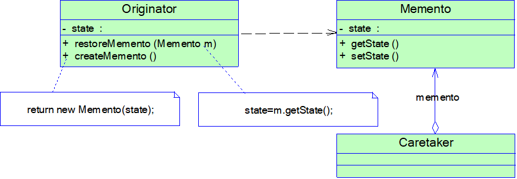

# Java设计模式——备忘录模式

## 1.备忘录模式

​		系统备份，多次撤销。命令模式记录增量信息，备忘录模式记录全局信息。命令模式通过命令对象执行业务操作，记录操作信息；备忘录模式不存在业务操作，只是用于记录当前的数据，通过读取数据实行撤销操作。

​		备忘录要求包内可见，不允许除了原发器以外的类对备忘录进行修改。

​		如果数量比较大，每次改动较小，可以采用增量撤销。如果数据的量比较少，数据变动较大，可以采用全局撤销



```java
class Chessman{
    String label;
    int x;
    int y;
	public  ChessmanMemo createMemo{
        return new ChessmanMemo(this);
    }
}
class ChessmanMemo{
    String label;
    int x;
    int y;
    public ChessmanMemo(Chessman chessman){
        
    }
   
}

class ChessMatchMemo{
    ArrayList<ChessmanMemo> chessmanMemos=;
    public ChessMatchMemo(ChessMatch chessMatch){
        //获得所有的ChessmanMemo进行备份
    }
}
class ChessMatch{
    ArrayList<Chessman> chessmans=;
    public ChessMatchMemo create(){
        return new ChessMatchMemo(this);
    }
    public void restore(ChessMatchMemo chessmatchMemo){
        
    }
}
```

​	

## 2.备忘录模式的特点

### 2.1优点

- 提供了一种状态恢复的实现机制，使得用户可以方便地回到一个特定的历史步骤
- 实现了对信息的封装，一个备忘录对象是一种原发器对象状态的表示，不会被其他代码所改动

### 2.2缺点

- 资源消耗过大，如果需要保存的原发器类的成员变量太多，就不可避免地需要占用大量的存储空间，每保存一次对象的状态都需要消耗一定的系统资源

### 2.3使用环境

- 保存一个对象在某一个时刻的全部状态或部分状态，这样以后需要时能够恢复到先前的状态，实现撤销操作
- 防止外界对象破坏一个对象历史状态的封装性，避免将对象历史状态的实现细节暴露给外界对象