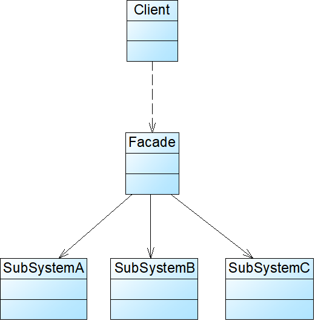

# Java设计模式——外观模式

## 1.外观模式：

​		为子系统中的一组接口提供和一个统一的入口。外观模式定义了一个高层接口，这个接口使得这一子系统更容易被使用。是迪米特法则的具体实现。

​		主要角色有两个：

​		1）Facade（外观角色）：客户端通过访问它的方法，在外观角色中存在子系统的对象成员，通过引用子系统类对象成员来实现子系统的功能（调用方法），具体方法的实现由子系统处理，外观角色只负责实例化子系统与调用子系统方法

​		2）SubSystem(子系统角色)：实现子系统的功能，被外观角色和客户端引用与调用其功能方法。外观类对子系统而言和客户端无异，而外观类对客户端而言是帮助客户端将指令传递到对应对应的子系统中，最后整理好发回给客户端。

​		外观模式使用类似于我们点菜。当我们不想自己做菜时，觉得操作厨具与处理食材（子系统角色的功能方法）太麻烦，就可以请一个厨师（外观角色）过来，帮助你操作锅碗瓢盆与食材（子系统角色），你最终只需要告诉厨师你需要什么（调用外观模式的功能方法），厨师（外观角色）会将对应厨具与食材操作起来（调用子系统的方法），最终将成品给你（返回结果）

## 2.抽象外观类

​		为了避免在需要增加、删除或更换与外观类交互的子系统类，必须修改外观类或者客户端的源代码，违背开闭原则，我们引入了抽象外观类。客户端依旧对外观类编程，但对于新的业务需求，无需修改外观类，只需修改配置文件即可。由此外观类就需要继承抽象外观类。同样用做菜的例子,你今天想要吃番茄炒蛋，你雇佣的那位厨师会做，但是要是你要吃青椒炒蛋，那位厨师就可能不会做了，解决的方法就是将自己想吃的东西大声喊出来（配置文件内配置具有对应功能的类），然后自己就会得到一个厨师（抽象外观类），那个厨师就有对应做出青椒炒蛋的技能（外观类的功能方法），你最终只要和之前一样跟厨师说明对应的需求（调用对应的功能方法）与提供对应的材料（参数）即可。这是的厨师这个职业就是抽象外观类，而会青椒炒蛋的厨师就是继承了抽象外观类的外观类。

## 3.外观模式的特点

​		1）优点：

​		①对客户屏蔽子系统组件，减少了客户处理的对象数目并使得子系统使用起来更加容易。通过引入外观模式，客户代码将变得很简单，与之关联的对象也很少。用户只管提需求，具体的操作交给外观类即可，优点像工厂模式，但是工厂模式是提供对象，具体操作还需要用户一步一步操作，他不会做出一道菜，但是会给你做菜需要的鸡蛋和青椒以及他们能操作的方法，至于鸡蛋和青椒如何如何混合处理产生青椒炒蛋，这都不是工厂模式需要考虑的，而且工厂模式一般只有自己生产出对象的成员不包含其他不属于该工厂的成员，

​		因此工厂模式是创建型模式，而外观模式这是结构型模式，提出一种类的成员结构与继承链，客户只需要调用结构中的一环，那一环就可以通过继承链或者调用成员方法来实现方法的功能，需要与之相关联的类（成员类对象、父类）对信息进行处理，即可实现对应的功能，而创建型模式提供一个对象的创建，将类对象中的成员组合与处理好交给客户，客户最后不会再找工厂的其他类进行处理，只在工厂提供的类中调用方法，传入信息，就可以实现自己想要的功能。
​		②实现了子系统与客户之间的松耦合关系，这使得子系统的组件变化不会影响到调用它的客户类，只需要调整外观类即可。
降低了大型软件系统中的编译依赖性，并简化了系统在不同平台之间的移植过程，因为编译一个子系统一般不需要编译所有其他的子系统。一个子系统的修改对其他子系统没有任何影响，而且子系统内部变化也不会影响到外观对象。要是菜感觉咸了只要在其中一个子系统中做出少加盐的修改，就可以了，不用破坏整个结构流程。
​		③只是提供了一个访问子系统的统一入口，并不影响用户直接使用子系统类。你要是愿意也可以自己操作对应的厨具进行做菜，但是会比较麻烦，但可以想通过厨师之手做出大概（调用外观类方法），再根据自己的喜好做出一些味道的修改，比如加盐、加糖之类的（调用子系统方法）

​		2）缺点：

​		①不能很好地限制客户使用子系统类，如果对客户访问子系统类做太多的限制则减少了可变性和灵活性。
​		②在不引入抽象外观类的情况下，增加新的子系统可能需要修改外观类或客户端的源代码，违背了“开闭原则”。

​		3）使用场景：

​		①当要为一个复杂子系统提供一个简单接口时可以使用外观模式。该接口可以满足大多数用户的需求，而且用户也可以越过外观类直接访问子系统。
​		②客户程序与多个子系统之间存在很大的依赖性。引入外观类将子系统与客户以及其他子系统解耦，可以提高子系统的独立性和可移植性。
​		③在层次化结构中，可以使用外观模式定义系统中每一层的入口，层与层之间不直接产生联系，而通过外观类建立联系，降低层之间的耦合度。

PS.如果有多个子系统需要多个外观类

