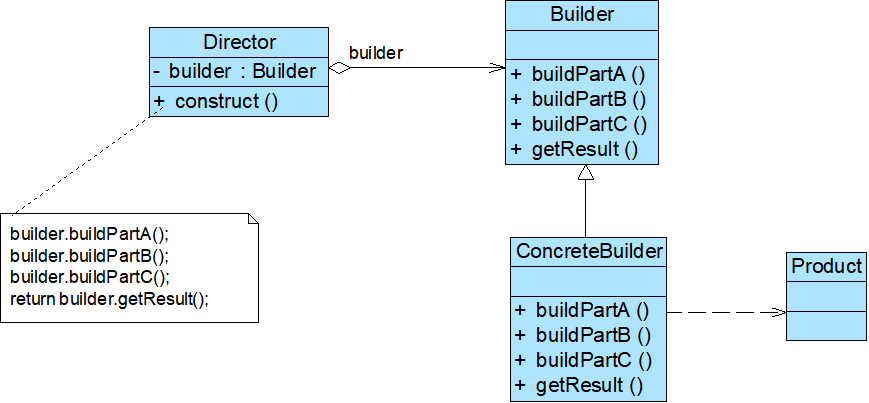

# Java设计模式——建造者模式

## 1.建设者

​		将一个复杂对象的构建与他的表示分离。使得同样的构造过程可以创建不同的表示。

​		主要角色：

​		1）Builder(抽象建造者)：为产品对象的各个部件指定抽象接口，构建两类方法——buildPartX()一个类的部分表示的构建方法，getResult()(返回由部分方法组成的类对象)

​		2）ConcreteBuilder(具体建造者):实现Builder的接口，将一个类各个部分通过方法构建，最终通过getResult进行整合。也可以让Builder用default默认方法实现所有具体制造者的成品默认整合方法

​		3）Product(产品)：有具体建造者创建的负责对象，由getResult获得，产品类的各个部分的构建由具体建造者的各个部分的方法组成，具体制造者的零部件方法不一定全部被调用，但是会按照一定顺序进行部分的整合拼装。

​		4）Director(指挥者)，负责安排负责对象的建造次序。指挥者和抽象建造者之间的关联关系，改角色类具有construct（）建造方法，该方法调用具体建造者中部件构造与装配方法，完成复杂对象的创建。客户端只需要与指挥者交互，在客户端确定具体将啧啧的类型，并实例化具体建造者对象（也可以通过配置文件与反射机制实现），然后通过指挥者者类的构造函数或者Setter方法将对象传入指挥类中。

- 如果我想要获得一台能打游戏的电脑（**产品**），在排除自己组装的前提下，我们会告诉电脑卖家（**指挥者**）一个指令或者需求，
- 然后电脑卖家会根据需求去启动能生产所有产品的机器（**抽象建造者**），选择能打游戏的电脑电脑制造功能（**实例化具体建造者**），也可以直接把用户的需求直接塞入机器让机器自己去识别出要造电脑的功能（**运用配置文件和反射机制实现**）
- 机器会打开电脑制造所需要的方法，将制造点电脑的各个步骤提供给电脑卖家。因为这个机器还不够智能，机器并不知道如何去制造一台电脑，因此无论哪种方式去实例化具体建造者，都会让机器在电脑制造功能的模块下让电脑卖家（**指挥者**）去一个一个按照组装电脑的顺序将电脑这个产品组装起来，店家只需一个个往下点就行了，不需要输入任何数字，
- 最终从机器中返回出能打游戏的电脑给电脑卖家（getResult()），然后电脑卖家再把成品给你(construct())。(也可以用做菜来举例)

**钩子方法：**在创建者接口中添加钩子方法作为步骤的判断，钩子方法返回的往往是true/false,交给具体创建者进行重写。在指挥者中调用钩子方法作为条件来确认对应的步骤是否要执行。

**建造者模式与抽象工厂模式**：建造者针对一个具体类的属性不同来创建对应的对象，而抽象工厂针对一个抽象类的不同子类及其不同属性来创建对应的对象

## 2.建造者特点

1）优点：

①客户无需知道产品内部组成的细节，将产品本身与产品的创建构成解耦，使得相同的创建构成可以创建不同的产品对象，比如如果我想要能工作的电脑，同样是跟电脑卖家说，不同的是电脑卖家会选择能工作电脑生成模块。然后一个一个去组装对应的产品，在电脑卖家（指挥者）看来无非就是由机器说明书规定的顺序（抽象建造者提供的方法往往具有一定的顺序意义）去点击然后让处于制造特定产品功能机器（具体制造者）去执行对应的构建与整合，最终获得我想要的产品

②每个具体建造者都是相互独立，而与其他具体具体建造者无关。用户告诉指挥者需求，指挥者会使用不同的具体制造者来获取不同的产品的对象，即使新增具体制造者或者替换具体建造者，也无需改动指挥者，指挥者只需在组装前实例化对应的具体制造者即可。

③将负责的建造过程拆分成不同的部分有利于控制，代码也更加清晰

2）缺点：

①创建的产品一般具有较多共同点。如果产品的差异很大，许多组成部分不相同，不适合使用建造者模式，比如我们就不能用造电脑的说明书来造水果榨汁机，毕竟后者都不需要昂贵的显卡

②如果产品的内部变化负责，可能会导致需要定义很多的具体建造者来实现这种变化，导致系统变得庞大，增加系统理解难度和运行成本。因为一般来说一个具体制造类只能对应一个具体的产品，不会传递参数，因此要是各个具体产品有很多版本且版本之间的属性差距很小，比如造饮料，少加一点白砂糖、多加点代糖就组成了低卡，关键是同样的配方细微差距的配比就是不同的品牌的产品，我们生活中可以找到各种各样的冰红茶

3)使用场景：

①需要生产的产品居于负责的内部结构，这些产品的对象往往具有相近的多个成员变量。

②需要生产的产品属性相互依赖，按照一定的顺序，逐步生成整个产品，比如组装电脑你只有确定了你的部分配件才能去找到能够与之相匹配的显卡、内存条，不能DDR4接口的内存条，你给个DDR3的插槽，那肯定是装不成的。

③对象创建过程独立于创建该对象的类，最终虽然是由指挥者返回的对象，但是实际上是由具体建造者创建好对应的产品。

④隔离复杂对象的创建和使用，并使得相同的创建过程能创建出不同从产品

​		
