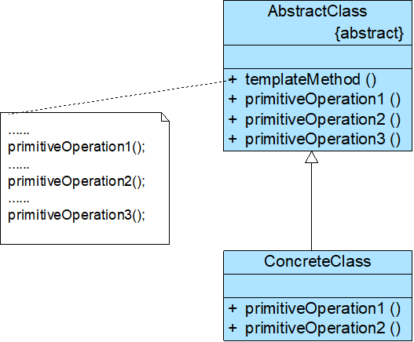

# Java设计模式——模板方法模式

## 1.模块模式



•AbstractClass（抽象类）:运行的过程实际调用

•ConcreteClass（具体子类）：利用重写来替换模板方法

## 2.钩子方法的使用

```java
public abstract class AbstractClass {
    //模板方法
    public void templateMethod() {
        primitiveOperation1();
        primitiveOperation2();
        primitiveOperation3();
}

    //基本方法—具体方法
    public void primitiveOperation1() {
        //实现代码
    }

    //基本方法—抽象方法
    public abstract void primitiveOperation2();    

    //基本方法—钩子方法,对于抽象方法或者接口中定义的方法的一个空实现，需要用到的具体模板去重写对应的钩子方法，如果不需要可以不用去实现对应的钩子方法
    public void primitiveOperation3()   
    {  }
}
public class ConcreteClass extends AbstractClass {
    public void primitiveOperation2() {
        //实现代码
    }

    public void primitiveOperation3() {
        //实现代码
    }
}

```


## 3.模块模式的特点

### 3.1优点

- 在父类中形式化地定义一个算法，而由它的子类来实现细节的处理，在子类实现详细的处理算法时并不会改变算法中步骤的执行次序
- 提取了类库中的公共行为，将公共行为放在父类中，而通过其子类来实现不同的行为
- 可实现一种反向控制结构，通过子类覆盖父类的钩子方法来决定某一特定步骤是否需要执行更换和增加新的子类很方便，符合单一职责原则和开闭原则

### 3.2缺点

- 需要为每一个基本方法的不同实现提供一个子类，如果父类中可变的基本方法太多，将会导致类的个数增加，系统会更加庞大，设计也更加抽象（可结合桥接模式）

### 3.3适应环境

- 一次性实现一个算法的不变部分，并将可变的行为留给子类来实现
- 各子类中公共的行为应被提取出来，并集中到一个公共父类中，以避免代码重复
- 需要通过子类来决定父类算法中某个步骤是否执行，实现子类对父类的反向控制