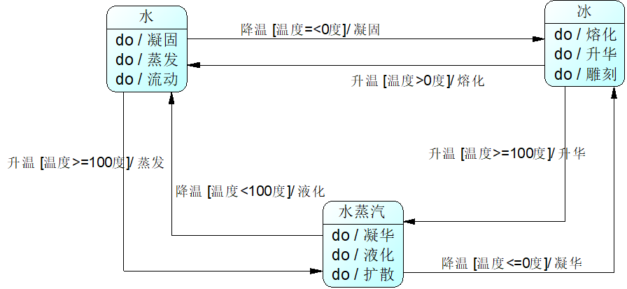
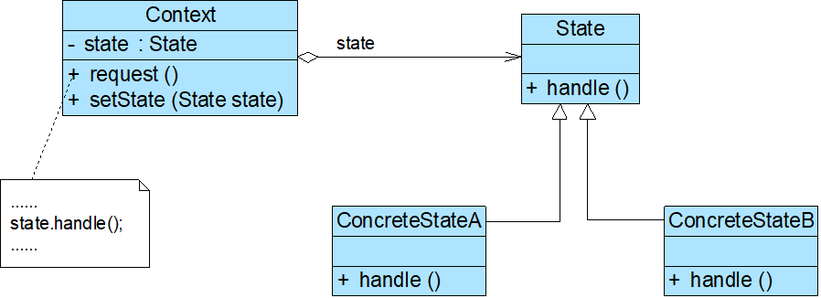
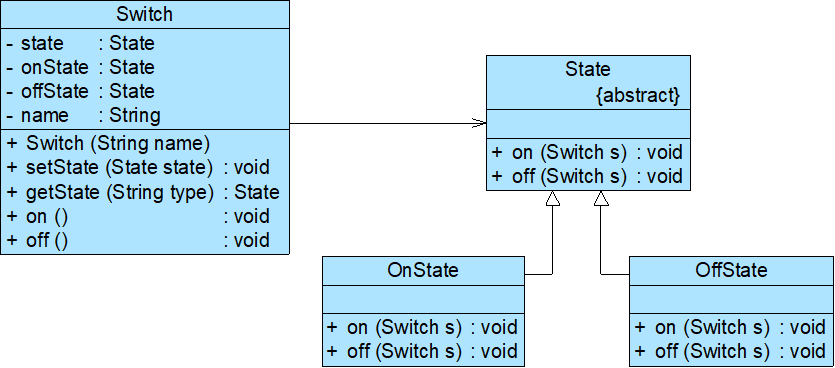

# Java设计模式——状态模式

## 1.状态模式

一般的状态模式所引用的状态最终都会是一个环。一个环境中存在着状态抽象类，当环境的某个属性发生变化时，调用对应的状态变化方法（request），将其状态进行对应的改变

- Context（环境类）
- State（抽象状态类）
- ConcreteState（具体状态类）

## 2.共享状态

在有些情况下，多个环境对象可能需要共享同一个状态。如果希望在系统中实现多个环境对象共享一个或多个状态对象，那么需要将这些状态对象定义为环境类的静态成员对象

- 开关类：Switch（环境类）
- 开关状态类：SwitchState （抽象状态类）
- 打开状态类：OnState（具体状态类）
- 关闭状态类：OffState （具体状态类）
- 客户端测试类：Client

## 3.状态模式的特点

### 3.1优点

- 封装了状态的转换规则，可以对状态转换代码进行集中管理，而不是分散在一个个业务方法中
- 将所有与某个状态有关的行为放到一个类中，只需要注入一个不同的状态对象即可使环境对象拥有不同的行为
- 允许状态转换逻辑与状态对象合成一体，而不是提供一个巨大的条件语句块，可以避免使用庞大的条件语句来将业务方法和状态转换代码交织在一起
- 可以让多个环境对象共享一个状态对象，从而减少系统中对象的个数

### 3.2缺点

- 会增加系统中类和对象的个数，导致系统运行开销增大
- 结构与实现都较为复杂，如果使用不当将导致程序结构和代码混乱，增加系统设计的难度
- 对开闭原则的支持并不太好，增加新的状态类需要修改负责状态转换的源代码，否则无法转换到新增状态；而且修改某个状态类的行为也需要修改对应类的源代码

### 3.3使用环境

- 对象的行为依赖于它的状态（例如某些属性值），状态的改变将导致行为的变化
- 在代码中包含大量与对象状态有关的条件语句，这些条件语句的出现会导致代码的可维护性和灵活性变差，不能方便地增加和删除状态，并且导致客户类与类库之间的耦合增强

