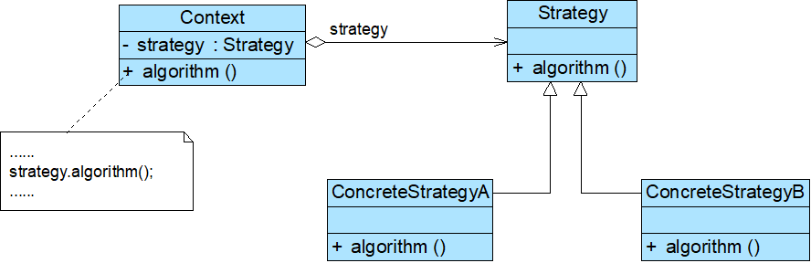

# Java设计模式——策略模式

## 1.策略模式

- Context（环境类）
- Strategy（抽象策略类）
- ConcreteStrategy（具体策略类）

## 2.策略模式的特点

### 2.1优点

- 提供了对开闭原则的完美支持，用户可以在不修改原有系统的基础上选择算法或行为，也可以灵活地增加新的算法或行为
- 提供了管理相关的算法族的办法
- 提供了一种可以替换继承关系的办法
- 可以避免多重条件选择语句
- 提供了一种算法的复用机制，不同的环境类可以方便地复用策略类

### 2.2缺点

- 客户端必须知道所有的策略类，并自行决定使用哪一个策略类
- 将造成系统产生很多具体策略类
- 无法同时在客户端使用多个策略类

### 2.3使用环境

- 一个系统需要动态地在几种算法中选择一种
- 避免使用难以维护的多重条件选择语句
- 不希望客户端知道复杂的、与算法相关的数据结构，提高算法的保密性与安全性

ps.和模板方法模式不同，他主要是没有默认的步骤，必须实现对应的算法实现部分，而模板方法模式可以使用钩子方法或者在抽象层实现号默认的方法。
