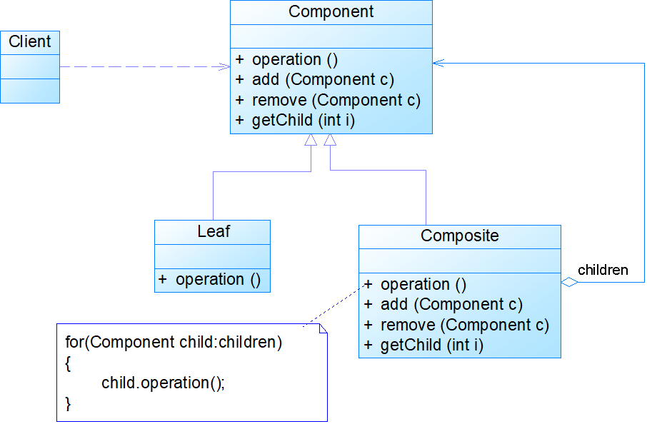
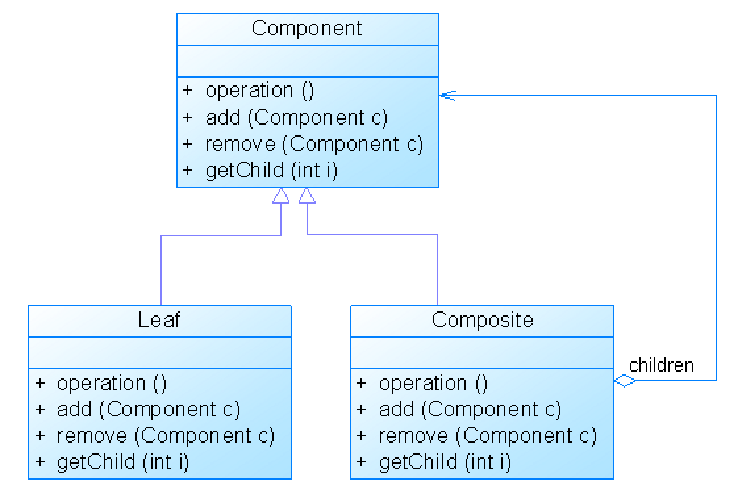

# Java设计模式——组合模式

## 1.组合模式

 		组合多个对象形成属性结构一表示具有部分-整体关系的层次结构。组合模式让客户端能同意对待单个对象和组合对象

​		管理树形结构，让树形结构的每个结点和树叶能够具有可管理的功能，让同类结点具有相同的功能，各种同类结构整合起来交给树的管理器进行管理，让管理器能够统一使用对应的结点。

​		主要角色有三个：

​		Component抽象构件：接口或者时抽象类，拥有三类方法：1.子类公共方法的声明与实现2.管理子类的方法3.为叶子构件和容器构件声明接口

​		Leaf叶子构件：代表叶子结点对象，无子节点，实现抽象构件的第三类方法提供的接口，抽象构件通过第二类方法来处理叶子结点，叶子构件无法使用管理子节点的方法（第二类方法），需要利用方法重写，通过抛出异常、提示错误对子节点进行处理。

​		Composite容器构件：代表容器结点对象，包含子节点，其子节点可以是叶子结点，也可以是容器结点，容器构件提供一个空间存储子节点，实现抽象构件的第三类方法、第二类方法，通过递归调用的方式层级访问子节点。

​		无论是叶子构件还是容器构件都会继承抽象构件，每一个结点都是抽象构件，不同的是叶子构件与其他结点相同，但是没有子节点，所有的结点由容器构件收集整合，容器构件可以新增与删除结点，还可以访问对应的子节点与通过递归或者循环处理子节点。由于都是继承了抽象构件，所以容器构件可以存储容器构件以达成一种多分支的效果，从而形成存储树形结构。拿我们平时整理东西为例，所有的物品假设都存放在一个盒子中，盒子本身其实也是物品，不同的是我们可以通过盒子存放多个物品，甚至为了让物品更好地分类我们会把同类型或者相关的物品放在一个小盒子里，再用大盒子装那个大盒子，盒子就相当于是容器构件，我们可以通过打开盒子取除或者加入对应的物品（调用容器构件的删除与新增方法），有的时候我们就是想看看可以打开盒子去看看自己的东西是否还在那（调用容器构件的查看外层构件方法），当然如果那个东西在小盒子中，我们就需要继续打开小盒子去查看对应的物品，取除与加入物品到小盒子也是同理的。如果哪天我们需要清洗大盒子里面所有的东西，我们要做的就是把他们一个个访问过去，不是盒子就直接清洗（调用叶子构件的业务方法），如果是盒子也是直接清洗，但是我们会像清洗大盒子物品一样，把小盒子里面的物品一个个拿过来清洗一遍（调用容器构件的业务方法，该业务方法通过递归或循环调用其中所有子节点的业务方法）。最终把所有的盒子与物品拿出来清洗完后（调用最高层容器构件的业务方法）放回对应的位置，便完成了我们要清理盒子的任务。

## 2.透明组合模式与安全组合模式

​		**透明组合模式：**从偷懒的角度来看，透明组合模式在复制粘贴上节省了很大的功夫，所谓透明组合模式就是盒子就是物品，物品也可以当作一个不能存储的盒子，通过限制物品存储的方法（对叶子节点的管理与访问子节点方法设置抛异常与报错处理），来避免物品被当作盒子来存储物品。而这种将所有的业务透露给所有成员，会导致代码冗余且极有可能导致忘记给对应的叶子节点对应的报错方法，最终错误使用管理方法。

​		叶子节点也去实现对应的管理方法，可以便于统一管理，将叶子节点的识别工作交给实际使用的叶子结点的操作进行处理，使得抽象组件的子类不再受叶子节点性质的影响，每一个都可以做出容器一样的功能，只不过有的结点（叶子结点）不能存储其他的结点。

​		**安全组合模式：**将抽象构件只保留子类公共方法与接口，将管理子节点的方法作为容器构件的特有方法，以避免出现叶子结点调用管理方法的问题。但是由此得出的组合模式保证安全的前提下却缺失了管理子构件的拓展性，客户端无法直接通过抽象构件直接调用对应的方法，需要转换成对应的容器才能进行组件的管理。

## 3.组合模式的特点

1）优点：

①可以清楚地定义分层次的复杂对象，表示对象的全部或部分层次，使得增加新构件也更容易。假设盒子是无限大的，我们可以往盒子中随意放置对应给物品，只要有对应的物品存在（叶子构件或者容器构建）便可以直接放入大盒子中。
②客户端调用简单，客户端可以一致的使用组合结构或其中单个对象。客户端只需要打开盒子（调用抽象构件的方法）便可以把所有的东西当作盒子处理，不同的是有的盒子里面装不了东西，也看不到里面的构件也就是叶子构件。
③定义了包含叶子对象和容器对象的类层次结构，叶子对象可以被组合成更复杂的容器对象，而这个容器对象又可以被组合，这样不断递归下去，可以形成复杂的树形结构。盒子里面可以无限套娃
④更容易在组合体内加入对象构件，客户端不必因为加入了新的对象构件而更改原有代码。打开盒子，放入新的物品（新的叶子构件对象），关闭盒子——调用新增抽象构件方法

2）缺点：

①使设计变得更加抽象，对象的业务规则如果很复杂，则实现组合模式具有很大挑战性，而且不是所有的方法都与叶子对象子类都有关联。用户无法知道盒子内的物品是怎么存储的，
②增加新构件时可能会产生一些问题，很难对容器中的构件类型进行限制。无法对新构件的存储、删除进行限制，比如我们不想在盒子中放入文具，但是我们再放入对应的物品时没有对其是否是文具进行判断，那么就会导致文具被错误放入，我们无法控制对应的东西的权限。

​		解决方案：增加过滤条件抽象对象来判断对应的对象是否允许进行对应的操作，过滤条件抽象的实现对应着每一类结点，决定每一类结点的业务是否被允许。每次管理容器进行对应的管理操作的是否我们先调用对应的过滤条件对象，过滤条件对象是每个构件的成员对象，或者通过关键字表将对应的条件与对应的构件对应，通过条用过滤条件对象对应的权限校验方法，判断是否被允许去进行对应的管理方法。

3）使用场景

①需要表示一个对象整体或部分层次，在具有整体和部分的层次结构中，希望通过一种方式忽略整体与部分的差异，可以一致地对待它们。
②让客户能够忽略不同对象层次的变化，客户端可以针对抽象构件编程，无须关心对象层次结构的细节。
③对象的结构是动态的并且复杂程度不一样，但客户需要一致地处理它们。