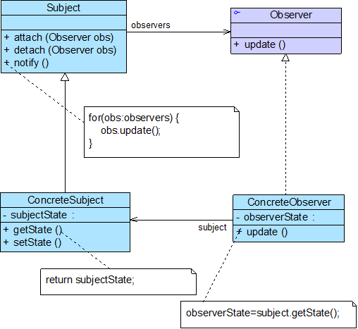

# Java设计模式——观察者模式

## 1.观察者模式



- Subject（目标）
- ConcreteSubject（具体目标）
- Observer（观察者）
- ConcreteObserver（具体观察者）

```
abstract class Obsever{
	Center center;
	String name;
	public Observer(){
		...
	}
	abstract public void help(String name);
	public void beAttacked(String attackName,String type){
		center.beAttack(attackName,name,type)
	}

}

public class SoldierPlay extends Observer{
	public void help(String name){
		System.out.println("执行反击")
	}
}


public class DoctorPlay extends Observer{
	public void help(String name){
		System.out.println("治疗"+name)
	}
}
abstract class Center{
	ArrayList<Observer> observer;
	...
	public abstract void beAttack(String attack	Name，String target,String type);
	
	public void notify(){
	//通知观察者
	}
}

class NowCenter extends Center{
	public void beAttack(String attackName,String target,String type){
		//非传入者,并进行判断伤害程度，再决定是否去通知。
		notify()
	} 
}
```

​	实际情况下，不是所有的观察者都实现了观察者对应的接口，需要利用适配器来适配对应的接口，让被观察者调用适配器来通知观察者。

​	适配器和观察者不同，适配器需要返还发送者对应的信息，而观察者要做的是接受信息，通知其他人，不一定要返还发送者对应的信息 	

## 2.观察者模式的特点

### 2.1优点

- 可以实现表示层和数据逻辑层的分离
- 在观察目标和观察者之间建立一个抽象的耦合
- 支持广播通信，简化了一对多系统设计的难度
- 符合开闭原则，增加新的具体观察者无须修改原有系统代码，在具体观察者与观察目标之间不存在关联关系的情况下，增加新的观察目标也很方便

### 2.2缺点

- 将所有的观察者都通知到会花费很多时间
- 如果存在循环依赖时可能导致系统崩溃
- 没有相应的机制让观察者知道所观察的目标对象是怎么发生变化的，而只是知道观察目标发生了变化

### 2.3使用环境

- 一个抽象模型有两个方面，其中一个方面依赖于另一个方面，将这两个方面封装在独立的对象中使它们可以各自独立地改变和复用
- 一个对象的改变将导致一个或多个其他对象发生改变，且并不知道具体有多少对象将发生改变，也不知道这些对象是谁
- 需要在系统中创建一个触发链
