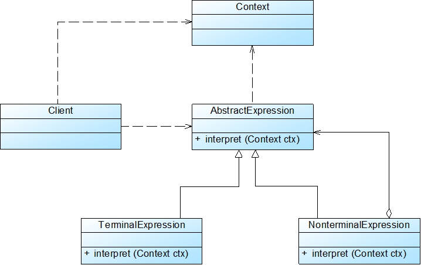
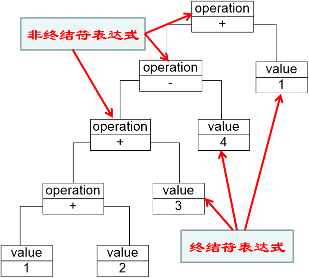

# 解释器模式

## 1.基本概念

- 抽象语法树（AST）

  描述了如何构成一个负责的句子，通过对抽象语法树的解析，可以识别出语言中的终结符内和非终结符类。

  先找到对应的终结符，再对终结符用非终结符进行语法描述

- 上下文对象：被跟踪组件的激活状态、安全信息

- 文法规则

  - “::=”表示“定义为”
  - “|”表示“或”
  - “{”和“}”表示“组合”
  - “*”表示“出现0次或多次”

  例如：

  ```
   expression ::= value | operation 
  
   operation ::= expression '+' expression  | expression '-' expression 
  
   value ::= an integer //一个整数值  
  ```

  

## 2.类图



- AbstractExpression（抽象表达式）
- TerminalExpression（终结符表达式）：语法树叶子结点，代表参与逐步形成结果的数据
- NonterminalExpression（非终结符表达式）：运算符号，结点交汇处。 
- Context（环境类）



## 3.特点

### 3.1优点：

- 易于改变和扩展文法，拓展文法只需添加非终结符类即可，且非终结符和终结符无关系，可以将文法和参与计算数据进行解耦
- 可以方便地实现一个简单的语言
- 实现文法较为容易（有自动生成工具）
- 增加新的解释表达式较为方便

### 3.2缺点

- 对于复杂文法难以维护
- 执行效率较低

### 3.3使用环境

- 可以将一个需要解释执行的语言中的句子表示为一棵抽象语法树
- 一些重复出现的问题可以用一种简单的语言来进行表达
- 一个语言的文法较为简单
- 执行效率不是关键问题