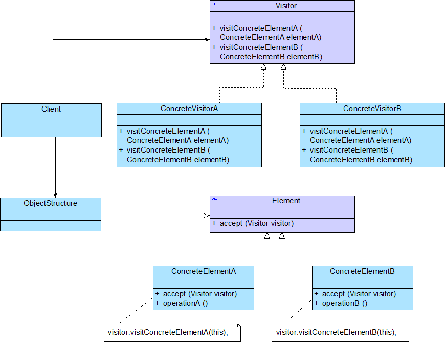
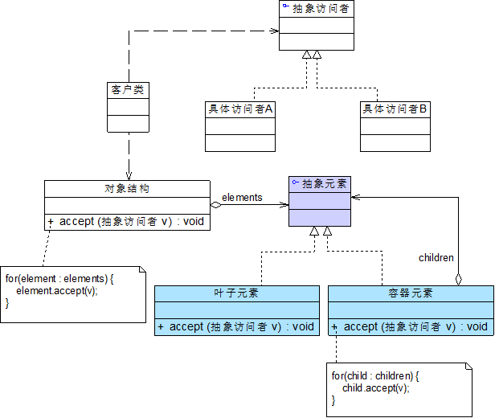

# Java设计模式——访问者模式

## 1.访问者模式

- Visitor（抽象访问者）
- ConcreteVisitor（具体访问者）
- Element（抽象元素）
- ConcreteElement（具体元素）
- ObjectStructure（对象结构）

### 访问者模式+组合模式

## 2.访问者模式的特点

### 2.1优点

- 增加新的访问操作很方便
- 将有关元素对象的访问行为集中到一个访问者对象中，而不是分散在一个个的元素类中，类的职责更加清晰
- 让用户能够在不修改现有元素类层次结构的情况下，定义作用于该层次结构的操作

### 2.2缺点

- 增加新的元素类很困难
- 破坏了对象的封装性

### 2.3使用环境

- 一个对象结构包含多个类型的对象，希望对这些对象实施一些依赖其具体类型的操作
- 需要对一个对象结构中的对象进行很多不同的且不相关的操作，并需要避免让这些操作“污染”这些对象的类，也不希望在增加新操作时修改这些类
- 对象结构中对象对应的类很少改变，但经常需要在此对象结构上定义新的操作
