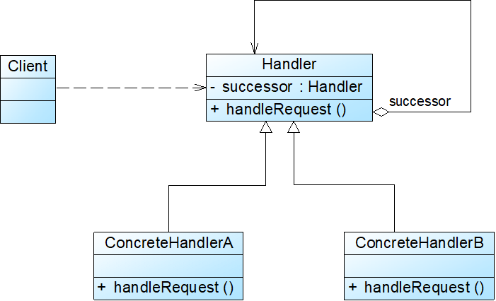
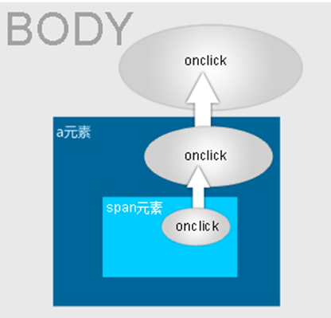

# Java设计模式——责任链模式

## 1.职责链模式

​		申请奖学金，只需要和辅导员说，无需知道自己应该改找谁审批

​		

​		职责链模式包含两个角色：

​		1.抽象处理者（Handler）

​		2.具体处理者(ConcreteHandler)

## 2.纯的职责链与不纯的职责链

### 2.1纯的职责链

- 一个具体处理者对象只能在两个行为中选择一个：要么承担全部责任，要么将责任推给下家
- 不允许出现某一个具体处理者对象在承担了一部分或全部责任后又将责任向下传递的情况
- 一个请求必须被某一个处理者对象所接收，不能出现某个请求未被任何一个处理者对象处理的情况

### 2.2不存的职责链

- 允许某个请求被一个具体处理者部分处理后向下传递，或者一个具体处理者处理完某请求后其后继处理者可以继续处理该请求

- 一个请求可以最终不被任何处理者对象所接收并处理

- JavaScript的事件浮升(Event Bubbling)处理机制

  

## 3.职责链模式特点

### 3.1优点

- 使得一个对象无须知道是其他哪一个对象处理其请求，降低了系统的耦合度
- 可简化对象之间的相互连接
- 给对象职责的分配带来更多的灵活性
- 增加一个新的具体请求处理者时无须修改原有系统的代码，只需要在客户端重新建链即可

### 3.2缺点

- 不能保证请求一定会被处理
- 对于比较长的职责链，系统性能将受到一定影响，在进行代码调试时不太方便
- 如果建链不当，可能会造成循环调用，将导致系统陷入死循环

### 3.3适用环境

- 有多个对象可以处理同一个请求，具体哪个对象处理该请求待运行时刻再确定
- 在不明确指定接收者的情况下，向多个对象中的一个提交一个请求
- 可动态指定一组对象处理请求

ps:

1.职责链不能动态制定处理一个请求的对象集合，并高效地处理一个请求，因为很有可能导致多个节点对数据不操作，只负责传递。

