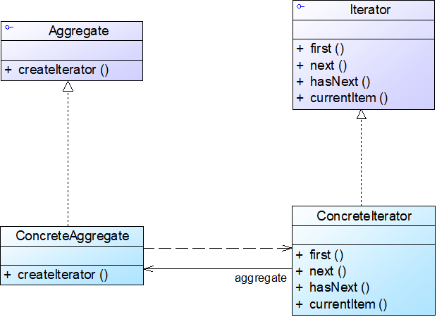
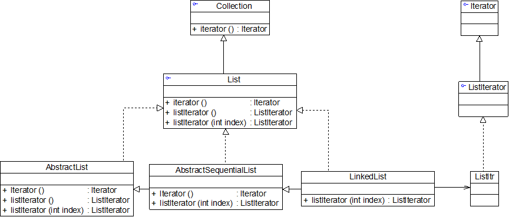

# Java设计模式——迭代器模式

## 1.迭代器模式

​		为什么使用迭代器：1.协调缓存，避免重复存储；2.设立权限，每次迭代产生的结果确保其合法性

- Iterator（抽象迭代器）
- ConcreteIterator（具体迭代器）
- Aggregate（抽象聚合类）
- ConcreteAggregate（具体聚合类）

## 2.Java内置迭代器

## 3.迭代器模式特点

### 3.1优点

- 支持以不同的方式遍历一个聚合对象，在同一个聚合对象上可以定义多种遍历方式
- 简化了聚合类
- 由于引入了抽象层，增加新的聚合类和迭代器类都很方便，无须修改原有代码，符合开闭原则

### 3.2缺点

- 在增加新的聚合类时需要对应地增加新的迭代器类，类的个数成对增加，这在一定程度上增加了系统的复杂性
- 抽象迭代器的设计难度较大，需要充分考虑到系统将来的扩展。在自定义迭代器时，创建一个考虑全面的抽象迭代器并不是一件很容易的事情

### 3.3使用环境

- 访问一个聚合对象的内容而无须暴露它的内部表示
- 需要为一个聚合对象提供多种遍历方式
- 为遍历不同的聚合结构提供一个统一的接口，在该接口的实现类中为不同的聚合结构提供不同的遍历方式，而客户端可以一致性地操作该接口